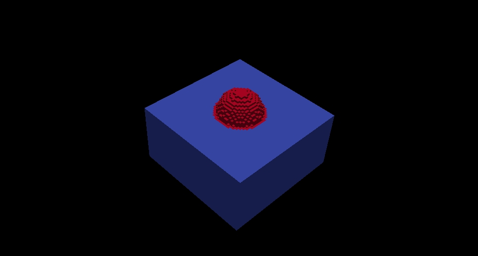
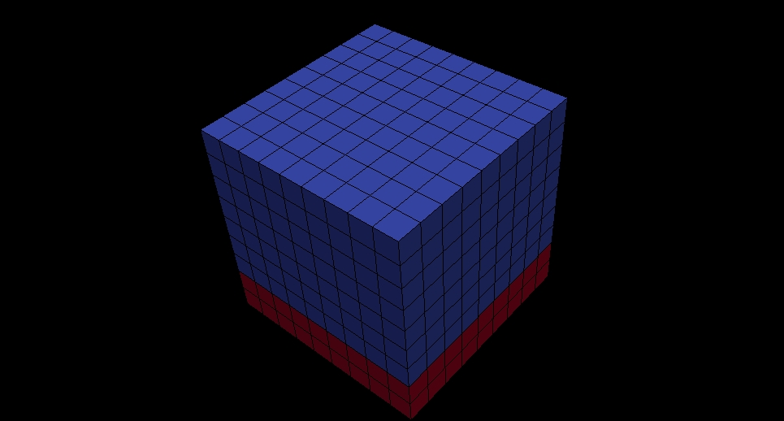
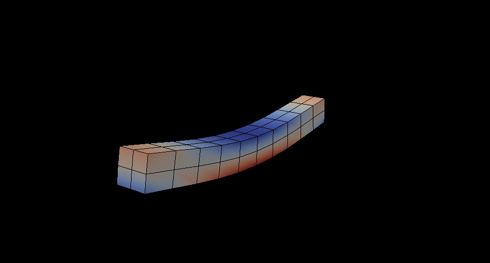
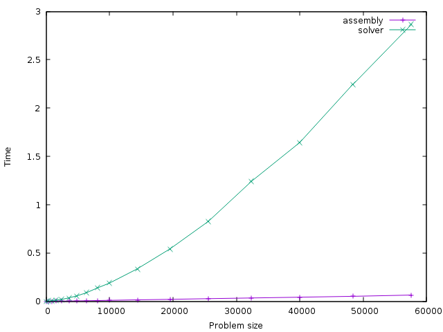

## Micropp

Code to localize and average strain and stress over a micro structure.

# Characteristics

1. Works with structured grids 2D or 3D
2. Plastic non-linear material model for testing the memory storage and efficiency.
3. Supports boundary condition : uniform strains (Pure Dirichlet)
4. Runs sequentially.
5. Own ELL matrix routines with CG iterative solver (diagonal pre-conditioner).
6. Different kinds of micro-structures

# Main Characteristics

`MicroPP` can simulate different kind of microstructures in 2D and 3D 





`MicroPP` has been coupled with high-performance codes such as [Alya](http://bsccase02.bsc.es/alya) developed at the
Barcelona Supercomputing center ([BSC](https://www.bsc.es/)) to performed **FE2** calculations.



`MicroPP` has its own ELL matrix format routines optimized for the structured grid geometries that it has to manage.
This allows to reach a really good performance in the assembly stage of the matrix.
The relation between the assembly time and the solving time can be below than 1% depending on the problem size.



# Compile

## Library and test examples
Requirements : `boost` (for some examples only), `g++` and `make`.

Debug version

```bash
make <test_1...8>
```

Optimized version

```bash
make <test_1...8> OPT=1
```

## Library only

Requirements : `g++` and `make`.

Debug version

```bash
make lib
```

Optimized version

```bash
make lib OPT=1
```
